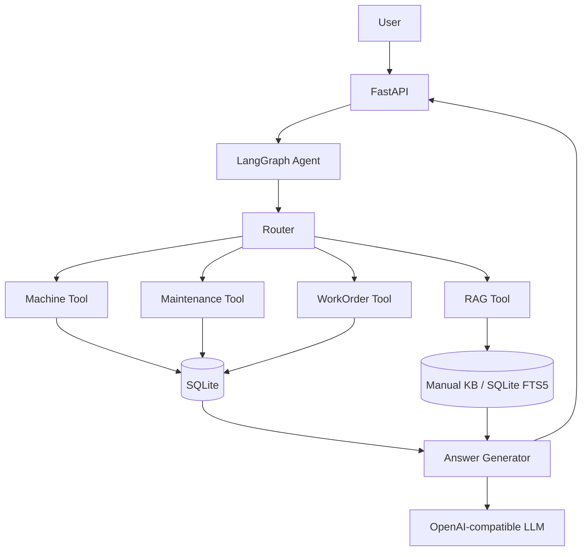

# FactoryAgent V1.1

FactoryAgent 是一个面向制造业设备运维场景的 AI Agent 求职展示项目。它把设备状态、维修历史、设备手册和维修工单串成一条可运行的业务链路，既支持 OpenAI-compatible 大模型，也支持没有 API Key 时的本地 Demo fallback。

## 项目简介

用户可以用自然语言查询机床状态、诊断报警、查看维修历史、检索设备手册，并通过“先拟定、后确认”的方式创建维修工单。

V1.1 的重点是完整展示 Agent 工程能力：

- FastAPI API 服务与 Swagger 文档
- LangGraph 状态化 Agent 流程
- LLM 结构化意图路由与本地关键词 fallback
- OpenAI / DeepSeek / 其他 OpenAI-compatible 接口
- SQLite 业务数据与设备手册知识库
- 中文设备手册 RAG 检索
- 维修工单确认机制，避免首次请求直接写库
- 可重复运行的自动化测试

## 业务背景

制造现场的设备运维人员通常需要在设备状态、历史维修记录和设备手册之间来回查询。FactoryAgent 用一个小型但完整的业务闭环演示：

1. 用户提出自然语言问题。
2. Agent 判断意图并选择业务工具。
3. 工具查询 SQLite 和设备手册。
4. Agent 汇总事实、原因和操作建议。
5. 涉及写操作时先展示工单草案，用户确认后才写入数据库。

## 核心功能

### 设备诊断

对于“3号机床今天为什么报警？”这样的请求，Agent 会执行：

- 查询设备当前状态
- 查询报警代码和温度
- 查询近期维修记录
- 检索设备手册
- 汇总可能原因和建议操作

### 结构化意图路由

配置 LLM 时，路由器要求模型输出 JSON：

```json
{"route": "machine_diagnosis"}
```

允许的意图为：

- `machine_diagnosis`
- `maintenance_records`
- `manual_search`
- `create_work_order`
- `general`

没有 API Key、模型不可用、响应格式不合法或请求超时时，会自动回退到本地关键词路由和本地答案生成逻辑。

### 工单确认

第一次请求只生成待确认草案：

```text
给3号机床建个维修工单，原因是主轴过热
```

Agent 会返回拟创建的设备、原因和确认提示，不写入数据库。随后同一 `session_id` 发送：

```text
确认
```

才会真正创建工单。

## 技术栈

- Python 3.11 / 3.13
- FastAPI
- LangGraph
- OpenAI Python SDK
- SQLite + FTS5
- Pydantic
- pytest

## 系统架构



## Agent 执行流程

1. `POST /chat` 接收用户消息和可选的 `session_id`。
2. 如果存在待确认工单，优先识别“确认”或“取消”。
3. 有 LLM 配置时，请求结构化意图；调用失败时使用关键词路由。
4. LangGraph 将请求分发到设备、维修记录、手册或工单节点。
5. 工具节点只返回可验证的业务数据。
6. 有 LLM 时由模型组织答案；否则使用本地 fallback 模板。
7. 工单首次请求只保存进程内待确认草案，确认后才写 SQLite。

## 项目目录

```text
factory-agent-v1/
├── app/
│   ├── agent/
│   │   ├── graph.py       # LangGraph 路由和业务节点
│   │   ├── llm.py         # LLM 调用、结构化路由、fallback
│   │   ├── session.py     # 进程内待确认工单状态
│   │   └── tools.py       # 设备、维修、工单和 RAG 工具
│   ├── rag/
│   │   └── retriever.py   # SQLite FTS5 + 中文 LIKE fallback
│   ├── config.py          # .env 配置
│   ├── db.py              # SQLite 连接
│   ├── main.py            # FastAPI 应用和 REST 接口
│   ├── schemas.py         # Pydantic 请求/响应模型
│   └── seed.py            # 初始化演示数据
├── data/
│   └── manuals/           # 设备手册文本
├── tests/
│   └── test_api.py
├── .env.example
├── Dockerfile
└── requirements.txt
```

## 快速启动

推荐使用 Python 3.11 或 3.13。

```bash
python -m venv .venv
```

Windows PowerShell：

```powershell
.\.venv\Scripts\Activate.ps1
pip install -r requirements.txt
Copy-Item .env.example .env
python -m app.seed
uvicorn app.main:app --reload
```

macOS / Linux：

```bash
source .venv/bin/activate
pip install -r requirements.txt
cp .env.example .env
python -m app.seed
uvicorn app.main:app --reload
```

打开 Swagger：<http://127.0.0.1:8000/docs>

## LLM 配置

`.env` 只保存在本地，不要提交到 Git。配置项如下：

```env
LLM_API_KEY=
LLM_BASE_URL=https://api.openai.com/v1
LLM_MODEL=gpt-4o-mini
LLM_TIMEOUT_SECONDS=20
DATABASE_PATH=data/factory_agent.db
```

DeepSeek 示例：

```env
LLM_API_KEY=你的 DeepSeek API Key
LLM_BASE_URL=https://api.deepseek.com
LLM_MODEL=deepseek-chat
LLM_TIMEOUT_SECONDS=20
```

硅基流动示例：

```env
LLM_API_KEY=你的 SiliconFlow API Key
LLM_BASE_URL=https://api.siliconflow.cn/v1
LLM_MODEL=deepseek-ai/DeepSeek-V3.2
LLM_TIMEOUT_SECONDS=20
```

不配置 `LLM_API_KEY` 也可以运行完整 Demo。配置了 Key 但接口超时、鉴权失败或返回异常时，系统仍会回到本地路由和 fallback 答案。

## API 示例

### 健康检查

```bash
curl http://127.0.0.1:8000/health
```

### 设备列表

```bash
curl http://127.0.0.1:8000/machines
```

### 单台设备状态

```bash
curl http://127.0.0.1:8000/machines/CNC-003
```

### 维修记录

```bash
curl http://127.0.0.1:8000/machines/CNC-003/maintenance
```

### 工单列表

```bash
curl http://127.0.0.1:8000/work-orders
```

### Agent 对话

```bash
curl -X POST http://127.0.0.1:8000/chat \
  -H "Content-Type: application/json" \
  -d '{"message":"3号机床今天为什么报警？","session_id":"demo-001"}'
```

## Demo 示例

### 设备诊断

输入：

```text
3号机床今天为什么报警？
```

无 Key fallback 会返回当前状态、`SPINDLE_OVERHEAT`、温度 `86.7℃`、近期维修记录、手册中的主轴过热原因和冷却系统检查建议。

### 确认式工单

第一次请求：

```json
{
  "message": "给3号机床建个维修工单，原因是主轴过热",
  "session_id": "demo-work-order"
}
```

第二次请求：

```json
{
  "message": "确认",
  "session_id": "demo-work-order"
}
```

只有第二次请求会产生实际 `work_order_id`。

## 测试方式

在项目目录运行：

```bash
pytest -v
python -m compileall -q app
```

测试覆盖：

- 原有健康检查、设备诊断和工单回归测试
- 设备列表、设备详情和维修记录接口
- 中文手册 RAG 有内容检索
- 无 API Key fallback
- LLM 结构化路由
- LLM 客户端失败自动 fallback
- 工单确认后才写入数据库
- 无效设备编号返回 404

## 后续规划

以下内容留给 V2，当前 V1.1 不包含：

- 向量数据库和更大规模知识库
- PDF / DOCX 文档解析
- MCP Server
- 持久化多轮记忆
- Streamlit 或 React 前端
- Docker Compose 和自动评测平台
