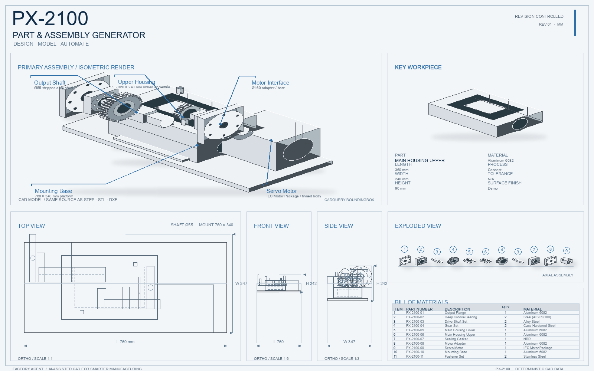
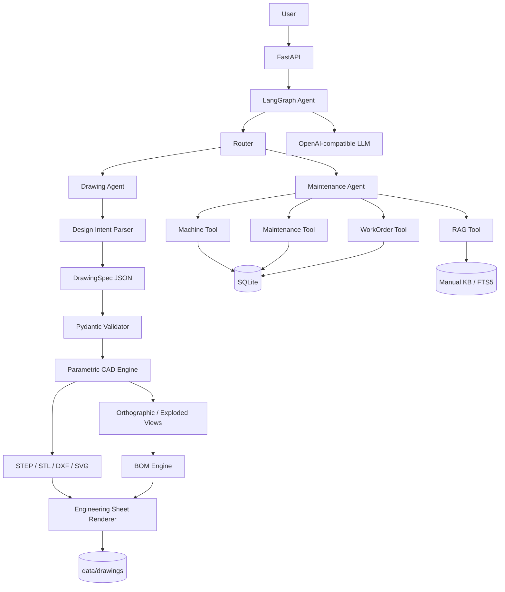

# FactoryAgent V4.3 · Engineering Agent

FactoryAgent 是一个面向制造业设备运维、参数化机械绘图和确定性工程验证的 AI Agent 求职展示项目。



> 当前仓库保留设备运维闭环和 V3 Drawing Agent，并增加 V4.3 通用 Engineering Agent。Planner 只负责把自然语言转换成 EngineeringObjectSpec；模板、工具链、CAD 导出、接口适配和工程验证全部由确定性代码执行。

## 项目简介

FactoryAgent 演示两条业务链路：

- Maintenance Agent：设备诊断、维修记录、中文手册检索和确认式维修工单。
- Drawing Agent：从自然语言生成 DrawingSpec，构建参数化零件/简化装配体，输出 CAD 文件、三视图、爆炸图、BOM 和 16:10 工程展示板。
- Engineering Agent：使用统一 Registry + Template + Tool Pipeline，当前包含 `plate`、`flange` 和 `parallel_gripper`；RG-80 只是 `ParallelGripperTemplate` 的默认参数集。

项目定位是可运行的 AI 应用/Agent 后端 MVP，不是生产级 MES、PLM 或制造放行系统。

## 核心功能

### Maintenance Agent

- 查询设备列表、设备状态和维修历史
- 诊断 `CNC-003` 主轴过热：状态、报警代码、温度、维修记录、手册原因和建议
- SQLite FTS5 + LIKE fallback 中文手册检索
- 维修工单“先拟定、后确认”，确认前不写正式工单表
- OpenAI-compatible LLM 结构化意图路由；没有 API Key 或接口失败时自动 fallback
- SQLite 持久化待确认状态与 Agent 执行轨迹

### Drawing Agent

支持自然语言创建和修改：

- `plate` 安装板
- `flange` 法兰
- `shaft` 轴
- `bracket` 支架
- `housing` 箱体
- `PX-2100 Modular Gear Drive` 简化装配体

每次生成使用同一份结构化设计数据输出：

```text
spec.json / spec_vN.json
model.step
model.stl
drawing.dxf
drawing.svg
sheet.svg
sheet.png
bom.json
```

校验包含：尺寸必须大于 0、孔中心必须在工件内部、孔径不能越界、Part ID 唯一、装配组件引用必须存在。错误时停止生成并返回修正建议。

### Engineering Agent V4.3

```text
Natural Language / EngineeringObjectSpec
                ↓
            Planner
                ↓
       EngineeringTemplateRegistry
                ↓
         EngineeringPipeline
   validate → geometry → selection
   → assembly → kinematics → interference
   → FEM handoff → drawing → export → provenance report
```

统一对象模型为 `Part`、`Assembly`、`Mechanism`。模板必须声明 capability；Pipeline 会跳过不需要的阶段，并把未支持的能力标记为 `unsupported` 或 `review_required`，不会让 LLM 编造 CAD、FEM 或仿真结果。

当前模板：

- `plate`：几何、三视图摘要、STEP/STL 导出
- `flange`：法兰孔阵列、几何、三视图摘要、STEP/STL 导出
- `parallel_gripper`：RG-80 默认参数、电机接口/STEP 导入、装配约束 recipe、连续开合运动、干涉检查和 FEM handoff

电机 STEP 通过 `MotorSpec.step_path` 提供时，会由 CadQuery 导入同一份 B-rep 并参与装配导出；没有 STEP 时保留明确标注的概念电机 fallback。V4.3 增加了一个制造商目录候选 `Oriental Motor PKP243D02B`：接口比较器会逐项比较轴径、止口、PCD、孔径、孔数和安装面，若不匹配则自动生成参数化 `Motor Adapter Plate` 与阶梯孔 `Flexible Coupling`，再重新导出同一装配体的 STEP/STL/BOM。

装配阶段会输出可在 FreeCAD/FreeCADCmd 中运行的 `freecad_assembly.py` 和 `assembly_constraints.json`。连续轨迹使用确定性的 swept-envelope 检查；安装 PyBullet 后可追加 proxy 刚体检查。FEM 阶段输出 CalculiX handoff 和解析预检，不会把解析预检冒充有限元结果。每个工程结论同时写入 `provenance.json`，明确区分 `VERIFIED`、`COMPUTED` 和 `REVIEW_REQUIRED`。

真实电机证据不提交到 Git。需要本地复现时运行：

```bash
python scripts/fetch_v43_motor_evidence.py
```

Planner 默认使用本地确定性 fallback；设置 `ENGINEERING_PLANNER_LLM=true` 后，若 LLM 配置可用，会先尝试结构化规划，失败时自动回退。

## 业务与系统架构

### 设备运维

```text
自然语言 → 结构化意图路由
          → 设备状态 / 维修记录 / 手册 RAG / 工单工具
          → 事实汇总与建议
```

### 参数化绘图

```text
自然语言
    ↓
LLM（只理解意图，可选）
    ↓
受约束的 DrawingSpec JSON
    ↓
Pydantic + Geometry Validator
    ↓
确定性的 CAD Engine
    ↓
STEP / STL / DXF / SVG
    ↓
三视图 / 爆炸图 / BOM / Engineering Sheet
```



### LLM 与工程数据边界

LLM 可以判断 `drawing_create_part`、`drawing_create_assembly`、`drawing_modify`、`drawing_export`、`drawing_explain`，并抽取尺寸、材料和修改意图。

LLM 不可以直接生成或执行 Python、拼接 DXF/STEP 文本，或自由编造 BOM 和几何尺寸。CadQuery 构建几何，BOM 从 `AssemblySpec.components` 聚合，图纸和展板从同一份 `DrawingSpec` 渲染。

## 技术栈

- Python 3.11 / 3.13
- FastAPI + Swagger、LangGraph、Pydantic
- OpenAI Python SDK（OpenAI-compatible、DeepSeek、SiliconFlow）
- SQLite + FTS5
- CadQuery（可选增强，生成真实 B-rep STEP/STL）
- ezdxf、Pillow（可选绘图增强）
- pytest

## 项目目录

```text
FactoryAgent V2 实战版/
├── app/
│   ├── agent/                 # 运维 + Drawing 路由和 LangGraph 节点
│   ├── drawing/
│   │   ├── schemas.py         # DrawingSpec / PartSpec / AssemblySpec
│   │   ├── parser.py          # 自然语言与 PX-2100 Demo 解析
│   │   ├── validator.py       # 几何和装配约束
│   │   ├── service.py         # 创建、修订、文件编排
│   │   ├── storage.py         # data/drawings 文件存储
│   │   ├── cad/               # CadQuery 引擎和导出器
│   │   ├── drawing/            # 三视图、尺寸、BOM、SVG
│   │   └── sheet/              # 16:10 工程展示板与 PNG
│   ├── engineering/
│   │   ├── models/              # Part / Assembly / Mechanism / Result
│   │   ├── templates/           # Registry + Plate / Flange / Gripper
│   │   ├── tools/               # geometry / selection / interfaces / kinematics / FEM / export
│   │   ├── adapters/            # motor STEP / adapter / FreeCAD / PyBullet / CalculiX
│   │   ├── catalog.py            # manufacturer-backed motor catalog and evidence
│   │   ├── planner.py           # 自然语言到 EngineeringObjectSpec
│   │   ├── pipeline.py          # capability-driven 通用执行链
│   │   ├── schemas.py           # 兼容请求和旧 RG-80 响应
│   │   ├── cad.py               # 概念平行夹爪 CAD 原语
│   │   └── service.py           # revision、存储和 legacy adapter
│   ├── rag/
│   ├── main.py                # REST API
│   └── seed.py                # 初始化运维演示数据
├── assets/demo_px2100.png    # README 展示图
├── tests/test_api.py
├── tests/test_drawing.py
├── tests/test_engineering.py
├── tests/test_engineering_generic.py
├── requirements.txt           # 基础可运行环境
├── requirements-drawing.txt   # CadQuery / ezdxf / Pillow
├── requirements-engineering.txt # optional PyBullet adapter
├── scripts/fetch_v43_motor_evidence.py
└── README.md
```

## 快速启动

### 基础环境

```bash
python -m venv .venv
```

Windows PowerShell：

```powershell
.\.venv\Scripts\Activate.ps1
pip install -r requirements.txt
Copy-Item .env.example .env
python -m app.seed
uvicorn app.main:app --reload
```

macOS / Linux：

```bash
source .venv/bin/activate
pip install -r requirements.txt
cp .env.example .env
python -m app.seed
uvicorn app.main:app --reload
```

打开 Swagger：<http://127.0.0.1:8000/docs>

### 启用真实 CadQuery STEP/STL

```bash
pip install -r requirements-drawing.txt
```

CadQuery 原生 wheel 较大，并受 Python 版本和操作系统影响，所以没有强制放进基础 requirements。未安装时仍会生成确定性的 SVG/DXF/STL fallback、结构化清单和工程展板；服务不会因此崩溃。

### 启用可选工程求解器

```bash
pip install -r requirements-engineering.txt
```

FreeCAD 和 CalculiX 通常使用官方安装包/系统包安装，不通过基础 Python requirements 强制安装。没有它们时，项目仍会生成真实 CadQuery STEP、FreeCAD recipe、约束 JSON、CalculiX 模板和 analysis plan；报告会标记 `review_required`，不会伪造 native assembly 或 FEM 数值。

### 真实电机与适配件 Demo

真实电机证据包不提交到 Git，需要本地复现时运行：

```bash
python scripts/fetch_v43_motor_evidence.py
```

然后调用：

```bash
curl http://127.0.0.1:8000/engineering/motors
curl -X POST http://127.0.0.1:8000/engineering/designs \
  -H "Content-Type: application/json" \
  -d '{"prompt":"设计一个真实电机夹爪，使用 PKP243D02B"}'
```

如果电机接口和夹爪输入端不一致，结果会返回逐项不兼容信息，并在输出中生成 `ENG-ADAPTER-PLATE-01`、`ENG-COUPLING-01`。这属于确定性接口适配设计，仍需确认材料、强度、轴伸和紧固件。

### LLM 配置

`.env` 只保存在本地，不能提交到 Git：

```env
LLM_API_KEY=
LLM_BASE_URL=https://api.openai.com/v1
LLM_MODEL=gpt-4o-mini
LLM_TIMEOUT_SECONDS=20
DATABASE_PATH=data/factory_agent.db
DRAWINGS_DIR=data/drawings
```

DeepSeek：

```env
LLM_BASE_URL=https://api.deepseek.com
LLM_MODEL=deepseek-chat
```

硅基流动：

```env
LLM_BASE_URL=https://api.siliconflow.cn/v1
LLM_MODEL=deepseek-ai/DeepSeek-V3.2
```

接口有超时、异常捕获和 JSON 校验。鉴权失败、超时、网关不支持 JSON mode 或模型返回非法结构时，会回退到本地解析/关键词路由。

## API 示例

### 运维 API

```bash
curl http://127.0.0.1:8000/health
curl http://127.0.0.1:8000/machines
curl http://127.0.0.1:8000/machines/CNC-003
curl http://127.0.0.1:8000/machines/CNC-003/maintenance
curl http://127.0.0.1:8000/work-orders
```

设备诊断：

```bash
curl -X POST http://127.0.0.1:8000/chat \
  -H "Content-Type: application/json" \
  -d '{"message":"3号机床今天为什么报警？","session_id":"demo-001"}'
```

维修工单：

```bash
curl -X POST http://127.0.0.1:8000/chat \
  -H "Content-Type: application/json" \
  -d '{"message":"给3号机床建个维修工单，原因是主轴过热","session_id":"wo-001"}'
curl -X POST http://127.0.0.1:8000/chat \
  -H "Content-Type: application/json" \
  -d '{"message":"确认","session_id":"wo-001"}'
```

### Drawing API

```bash
curl -X POST http://127.0.0.1:8000/drawings \
  -H "Content-Type: application/json" \
  -d '{"prompt":"画一个180×120×12mm的6061铝板，四角Ø10通孔，孔中心距离边缘15mm"}'
```

```bash
curl -X POST http://127.0.0.1:8000/drawings/DRW-XXXXXXXX/revise \
  -H "Content-Type: application/json" \
  -d '{"prompt":"把孔径改成12mm"}'
```

```text
GET /drawings
GET /drawings/{drawing_id}
GET /drawings/{drawing_id}/sheet
GET /drawings/{drawing_id}/sheet.png
GET /drawings/{drawing_id}/svg
GET /drawings/{drawing_id}/dxf
GET /drawings/{drawing_id}/step
GET /drawings/{drawing_id}/stl
GET /drawings/{drawing_id}/bom
```

### Engineering API

通用 Engineering API：

```bash
curl -X POST http://127.0.0.1:8000/engineering/designs \
  -H "Content-Type: application/json" \
  -d '{"prompt":"做一个180×120×12的安装板，四角Ø10孔"}'
```

```text
GET  /engineering/templates
GET  /engineering/motors
GET  /engineering/motors/{catalog_id}
GET  /engineering/designs/{engineering_id}
POST /engineering/designs/{engineering_id}/revise
POST /engineering/designs/{engineering_id}/simulate
POST /engineering/designs/{engineering_id}/fem
GET  /engineering/designs/{engineering_id}/report
GET  /engineering/designs/{engineering_id}/step
GET  /engineering/designs/{engineering_id}/stl
GET  /engineering/designs/{engineering_id}/drawing
GET  /engineering/designs/{engineering_id}/sheet
GET  /engineering/designs/{engineering_id}/sheet.png
GET  /engineering/designs/{engineering_id}/dxf
GET  /engineering/designs/{engineering_id}/bom
GET  /engineering/designs/{engineering_id}/assembly-constraints
GET  /engineering/designs/{engineering_id}/freecad
GET  /engineering/designs/{engineering_id}/fem-plan
GET  /engineering/designs/{engineering_id}/fem-template
GET  /engineering/designs/{engineering_id}/provenance
```

旧版 RG-80 兼容 API 仍然保留：

```bash
curl -X POST http://127.0.0.1:8000/engineering/grippers \
  -H "Content-Type: application/json" \
  -d '{"payload_kg":8,"workpiece_diameter_mm":60,"opening_max_mm":80,"close_time_s":0.8}'
```

返回 `design_id` 后可读取：

```text
GET /engineering/grippers/{design_id}
GET /engineering/grippers/{design_id}/report
GET /engineering/grippers/{design_id}/motion
GET /engineering/grippers/{design_id}/step
GET /engineering/grippers/{design_id}/stl
GET /engineering/grippers/{design_id}/provenance
```

## Demo

### 180 × 120 × 12 安装板

输入：

```text
画一个180×120×12mm的6061铝板，四角Ø10通孔，孔中心距离边缘15mm
```

得到 4 个孔中心 `(15,15)`、`(165,15)`、`(165,105)`、`(15,105)`，并生成真实/可升级的 STEP、STL、DXF、SVG、三视图和工程展示板。

### PX-2100 装配体

输入：

```text
生成 PX-2100 Modular Gear Drive 装配体
```

装配体由独立组件组成，爆炸位置通过 `position + exploded_offset` 计算，BOM 从组件实例聚合，序号和 BOM 保持一致。当前是求职展示用简化结构，不是复杂齿轮啮合设计。

## 测试与验证

```bash
pytest -v
python -m compileall -q app
```

当前包含 71 项测试，覆盖运维 Agent、RAG、LLM fallback、工单确认、trace、DrawingSpec、PX-2100 几何和布局、CAD 导出，以及 V4.3 Registry、模板能力、通用 Pipeline、真实电机目录证据、机械接口比较、自动适配板/联轴器、完整输出包、真实 STEP 电机导入、连续运动检查、FreeCAD recipe、FEM handoff、Provenance、Revision 隔离、unsupported/review 状态和新旧 API。

增强环境会重新读取 CadQuery STEP、ezdxf DXF 和 Pillow PNG；真实 CAD 文件只在安装 Drawing extras 后启用。

## 已知边界与后续规划

- RAG 仍是 SQLite FTS5 + LIKE，小规模中文手册优先；V2 再考虑向量数据库和 PDF 管线。
- bracket/housing 是简化参数化形体，PX-2100 齿轮只做展示级结构，不代表制造放行数据。
- revision 保留 `spec_v1.json`、`spec_v2.json` 等快照，最新输出文件名固定为 `model.*`。
- 基础安装的 STEP fallback 是标准文件框架与设计清单；需要真实 B-rep 时安装 `requirements-drawing.txt`。
- 当前没有鉴权、权限分级、Token/延迟统计和生产级审计。
- V4.3 的 RG-80 仍是 `ParallelGripperTemplate + RG80Preset` 的概念机构；PKP243D02B 是用于闭环演示的真实目录候选，不代表已经完成最终电机选型。接口适配件来自确定性参数化生成，默认概念电机不等于厂商选型。
- 当前机器未安装 FreeCAD、PyBullet、CalculiX，因此本次实测执行的是 CadQuery B-rep、确定性连续 swept 检查、FreeCAD recipe 和 CalculiX handoff；native FreeCAD 求解、PyBullet 刚体 proxy 和 CalculiX 应力结果需要在安装相应软件后运行。
- 真实制造商目录自动选型、轴承/联轴器数据库、复杂接触动力学、网格质量和材料卡片仍需工程数据与外部求解器支持；V4.3 已接入一个公开电机证据样例，但还不是通用供应商数据库；项目会把这些边界标为 `review_required`，不会生成伪造结果。
- 暂不实现 Qdrant、PDF 上传、MCP、Streamlit 和军事/航空可制造系统；CV-3000 只作为未来概念展示方向。

## License

MIT
